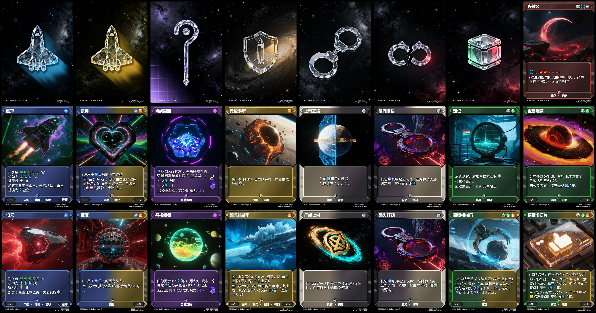

# Stellaris Scrimmage v5.0a 简体中文版 - 决战星海

**订阅项目：[https://memostudio.feishu.cn/docx/Xs9NdJ2MVoVjtfxRO2FcZZeKnqd](https://memostudio.feishu.cn/docx/Xs9NdJ2MVoVjtfxRO2FcZZeKnqd)**

**订阅电子桌游: [https://steamcommunity.com/sharedfiles/filedetails/?id=3561425988](https://steamcommunity.com/sharedfiles/filedetails/?id=3561425988)（需要[Tabletop Simulator](https://store.steampowered.com/app/286160/Tabletop_Simulator) on Steam）**

**订阅实体桌游物料电子资产：[https://pan.baidu.com/s/1x0aiz4nTghem9rvne0FDnQ?pwd=rvsy](https://pan.baidu.com/s/1x0aiz4nTghem9rvne0FDnQ?pwd=rvsy)（请使用[百度网盘](https://pan.baidu.com)下载）**

本仓库提供**决战星海v5.0a 简体中文版**卡牌和信标版图的版面源码，符合[Card Conjurer](https://cardconjurer.com)格式。版面和版背插画均使用[即梦AI](https://jimeng.jianying.com)制作。

---

`card_templates`：

- `{类型ID}-{类型简称}-{类型全称}`：存放对应类型全部正面版面文件源码。
  - `{类型ID}-{版ID}-{变体ID}-{名称}.json`：正面版面文件源码。JSON格式，适用于[Card Conjurer](https://cardconjurer.com)。
- `back_card`：存放全部类型的背面版面文件源码。
  - `{类型ID}-back-{变体ID}.json`：背面版面文件源码。JSON格式，适用于[Card Conjurer](https://cardconjurer.com)。
- `mod_{类型全称}.cct`：各类型版面母版（Card Conjurer Template）源码，适用于[Card Conjurer](https://cardconjurer.com)。

`tutorials`：存放规则手册，提示版图和关键词图标映射表PDF文件。

---

**使用方法**：在[Card Conjurer](https://cardconjurer.com)中导入所需的版面文件源码，然后按提示导入对应类型的版面模板，从而得到正确的版面渲染结果。（由于软件问题，**首次载入时可能出现渲染异常**，例如图标转义符未替换、字体异常等，请重复至少3次相同导入操作以确保获得正确的渲染结果。）

## 游戏概述

《决战星海》是一款兼具棋盘探索和卡牌元素的对抗式角色扮演游戏！扮演太空战机指挥官，探索充满危机的宇宙信标，抢占先机收集资源，用传奇装备武装自己，达成战略目标，称霸星海宇宙！

《决战星海》是一款以**棋盘-卡牌双互动**为核心的游戏。在游戏开始时，你将面对完全未知的棋盘，你可以在棋盘上移动，通过探测行动或使用手牌来揭示棋盘中的信标并从中获取资源。你也可以从共享的资源牌堆获取各类具有一次性效果的对策牌，用于进攻或防御。

《决战星海》提供策略性的**装备构筑**和**使令系统**。在游戏开始时，玩家仅有一件初始装备，你可以通过交易资源来购买装备，获取主动能力或被动增益效果，合理地构筑装备还能让它们互相增益。游戏预设了一系列战略目标，以使令牌的形式提供，抢先完成使令来制定游戏规则，不断累积影响力成为称霸宇宙的胜者！

## 主要玩法

**棋子地图探索+翻格子+装备构筑+共享牌库**

每位玩家轮流行动，在初始完全未知（面朝下随机盖满信标版图）的地图上移动，探索信标（翻转揭示）或使用信标来获取信用点和抽牌资源，通过完成公开使令区已揭示的使令来获取胜利点数，使令需求可能是移动一定次数、使用一定次数的信标，囤积信用点、手牌、装备，甚至是消灭对手的机甲！当你攒够10个胜利点数后便获得胜利。你每轮都可以花费10枚信用点在公开区域购买传奇装备进行构筑，通过与装备效果的交互提高资源积累效率、攻击对手或是提高自身抗性。在每回合内你还可以打出有限数量的手牌来获取额外资源、发射武器杀伤对手，或者预留出牌机会以便在回合外防御其它玩家的袭击。为了干扰其它玩家，你可以在它们的回合出牌或使用装备效果进行骚扰；也可以重拳出击消灭对手机甲使其失去资源和使令进度，机甲被消灭的玩家将延迟一回合才能重新部署。

## 展览

